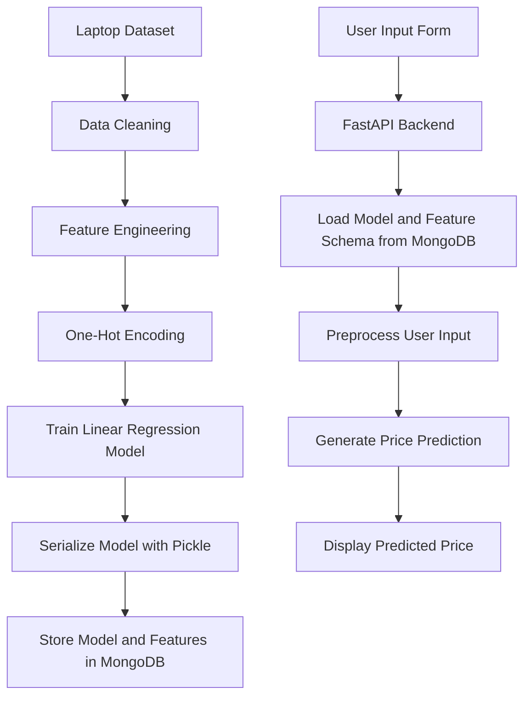

# Laptop Price Prediction Web App

A machine learning web application that predicts laptop prices based on hardware specifications such as brand, processor, RAM, storage, GPU, screen size, operating system, and weight.

The project combines data preprocessing, Linear Regression modeling, MongoDB storage, FastAPI backend development, and a custom HTML/CSS frontend.

---

## Demo


## Overview

Laptop prices depend on multiple specifications, including company, type, screen size, CPU, RAM, storage, GPU, operating system, and weight.

This project builds a machine learning pipeline that learns from laptop specification data and predicts an estimated price for a new laptop based on user input.

The application includes:

- Data cleaning and preprocessing
- Feature engineering
- One-hot encoding
- Linear Regression model training
- Model serialization using Pickle
- MongoDB storage for dataset, model, and feature schema
- FastAPI backend for prediction
- HTML/CSS frontend for user input

---

## Key Features

- Laptop price prediction from user-entered specifications
- Data preprocessing and feature cleaning
- Categorical feature encoding
- Linear Regression model training
- Model and feature schema storage in MongoDB
- FastAPI prediction endpoint
- Custom frontend form
- MongoDB-backed backend workflow

---

## Tech Stack

| Area | Tools |
|---|---|
| Programming | Python |
| Data Processing | Pandas, NumPy |
| Machine Learning | Scikit-learn |
| Model | Linear Regression |
| Backend | FastAPI, Uvicorn |
| Database | MongoDB |
| Frontend | HTML, CSS |
| Model Storage | Pickle |
| Notebook | Jupyter Notebook |

---

## Dataset

The dataset contains laptop specifications and prices.

Main features include:

- Company
- TypeName
- Inches
- ScreenResolution
- CPU
- RAM
- Memory
- GPU
- Operating System
- Weight
- Price

The dataset is stored in:

```text
data/laptop_price.csv
```

---

## Machine Learning Pipeline

The ML pipeline includes:

1. Loading the laptop price dataset
2. Cleaning numerical columns such as RAM and Weight
3. Handling categorical variables
4. Applying one-hot encoding
5. Splitting the data into training and testing sets
6. Training a Linear Regression model
7. Evaluating model performance
8. Saving the trained model and feature columns
9. Loading the model through the FastAPI backend
10. Predicting laptop prices from user input

---

## System Architecture



---

## Project Structure

```text
laptop-price-prediction-webapp/
│
├── app.py
│
├── data/
│   └── laptop_price.csv
│
├── notebooks/
│   └── Laptop_Price_Prediction.ipynb
│
├── templates/
│   └── index.html
│
├── assets/
│   └── UI images and static assets
│
├── screenshots/
│   └── app_screenshot.png
│
├── README.md
├── requirements.txt
└── .gitignore
```

---

## How to Run

### 1. Clone the repository

```bash
git clone https://github.com/amiraa23/laptop-price-prediction-webapp.git
cd laptop-price-prediction-webapp
```

### 2. Install requirements

```bash
pip install -r requirements.txt
```

### 3. Start MongoDB

Make sure MongoDB is running locally:

```text
mongodb://localhost:27017/
```

### 4. Prepare the model and database

Open the notebook:

```bash
jupyter notebook
```

Then run:

```text
notebooks/Laptop_Price_Prediction.ipynb
```

The notebook prepares the dataset, trains the model, and stores the trained model and feature columns in MongoDB.

### 5. Run the FastAPI app

```bash
uvicorn app:app --reload
```

### 6. Open the app

```text
http://127.0.0.1:8000/
```

---

## API Endpoint

### Prediction Endpoint

```text
POST /predict/
```

Example input:

```json
{
  "Company": "Dell",
  "TypeName": "Notebook",
  "Inches": 15.6,
  "ScreenResolution": "Full HD 1920x1080",
  "Cpu": "Intel Core i5",
  "Ram": 8,
  "Memory": "256GB SSD",
  "Gpu": "Intel HD Graphics",
  "OpSys": "Windows 10",
  "Weight": 2.0
}
```

Example output:

```json
{
  "predictions": [65000.0]
}
```

---

## Screenshot


---

## Limitations

This project is an academic prototype and has some limitations:

- The model uses Linear Regression only.
- More advanced models such as Random Forest, XGBoost, or Gradient Boosting could improve performance.
- The app depends on MongoDB being available locally.
- The model and feature schema must be inserted into MongoDB before running predictions.
- The current version does not include authentication or production deployment.
- Price predictions depend on the quality and coverage of the dataset.

---

## Future Improvements

Possible future improvements include:

- Compare multiple ML models
- Add MAE, RMSE, and R² evaluation metrics
- Add model selection and hyperparameter tuning
- Improve feature engineering for CPU, GPU, RAM, and storage
- Add a persistent deployed backend
- Add Docker support for FastAPI and MongoDB
- Improve frontend validation and user experience
- Add admin dashboard for dataset and prediction logs

---

## What I Learned

Through this project, I practiced:

- Building an end-to-end ML prediction workflow
- Cleaning and preprocessing real-world tabular data
- Training a regression model using Scikit-learn
- Saving and loading ML models using Pickle
- Connecting a machine learning model to a FastAPI backend
- Using MongoDB for storing datasets, models, and feature schemas
- Building a simple web interface for model predictions
- Understanding how ML models can be integrated into backend applications

---

## Conclusion

Laptop Price Prediction Web App demonstrates how a machine learning model can be integrated into a backend-driven web application.

The project connects data preprocessing, model training, MongoDB storage, FastAPI prediction endpoints, and frontend interaction to create a complete ML application prototype.
